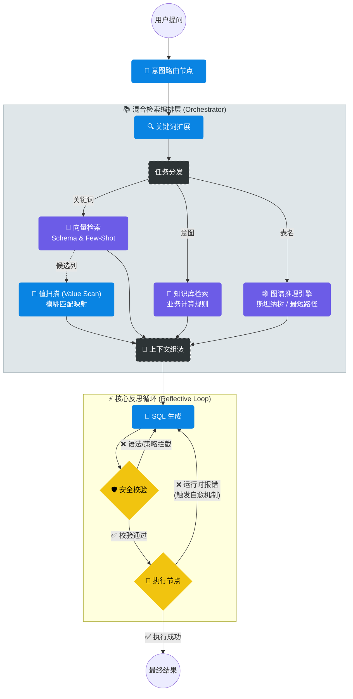

# DeepOps Enterprise Copilot ⚡

> **Next-Gen Text-to-SQL Agent powered by LangGraph & Graph RAG**
> 
> *基于图谱增强与自我反思机制的企业级数据库运维智能助手*

[]()
[]()
[]()


*(演示：自然语言查询 -> 意图识别 -> 混合检索 -> 图谱推理 -> SQL 自愈生成 -> 智能可视化)*

## 📖 项目简介 (Introduction)

**DeepOps Enterprise Copilot** 是一个面向复杂企业数据库场景的智能运维 Agent。

针对传统 Text-to-SQL 在**多表关联 (JOIN)** 和 **业务术语理解** 上的痛点，本项目采用了 **LangGraph** 构建环形状态机，并创新性地引入了 **Schema Graph RAG** 技术。通过 NetworkX 构建的全库表关系图谱，系统能够自动计算最佳 JOIN 路径，结合语义检索（Milvus）和值扫描（Value Scanning），实现高准确率的 SQL 生成与自愈。

---

## 🚀 核心技术架构 (Architecture)

### 1. 🧠 Agentic Workflow (基于 LangGraph 的状态机)
系统摒弃了线性的 Chain 结构，采用 **LangGraph** 定义了一个具备“反思”能力的循环工作流：



## 2. 项目结构（阶段性演进）
```text
dbops-enterprise-copilot/
├── 📜 main.py                    # [Entry] FastAPI 后端启动入口
├── 📂 app/
│   ├── 📂 api/
│   │   └── v1/
│   │       └── agent.py          # 核心 API 路由 (Chat Interface)
│   │
│   ├── 📂 core/                  # [Infrastructure] 基础设施层
│   │   ├── config.py             # 全局环境变量配置
│   │   ├── llm.py                # LLM 模型工厂 (Model Factory)
│   │   ├── embedding.py          # 向量化模型单例
│   │   ├── rag_store.py          # Milvus DAO (Schema/Knowledge/FewShot 集合管理)
│   │   ├── prompts.py            # Prompt 模板库 (Router/GenSQL/FixSQL)
│   │   └── state.py              # LangGraph 全局状态定义 (AgentState)
│   │
│   ├── 📂 graph/                 # 🔥 [Core Logic] LangGraph 状态机
│   │   ├── graph.py              # 工作流定义 (Workflow & Conditional Edges)
│   │   └── 📂 nodes/             # 独立功能节点
│   │       ├── router_node.py        # 意图识别
│   │       ├── retrieval_node.py     # 检索调度
│   │       ├── generate_node.py      # SQL 生成
│   │       ├── verification_node.py  # 语法检查与权限审计
│   │       └── execution_node.py     # SQL 执行与反馈
│   │
│   └── 📂 modules/               # [Business Modules] 业务组件
│       ├── 📂 retrieval/         # 🔍 检索增强引擎 (RAG Engine)
│       │   ├── orchestrator.py       # 🧠 检索编排器 (Schema + Knowledge + Value)
│       │   ├── value_scanner.py      # 模糊值匹配 (Value Linking)
│       │   ├── schema_helper.py      # Schema 格式化与 Token 压缩
│       │   ├── 📂 graph/             # 🕸️ 图谱增强 (Graph RAG)
│       │   │   ├── builder.py            # 图构建器 (NetworkX MultiGraph)
│       │   │   ├── searcher.py           # 路径搜索算法 (Steiner Tree / Shortest Path)
│       │   │   └── service.py            # 图服务单例
│       │   └── 📂 knowledge/         # 业务规则检索
│       │       └── retriever.py
│       │
│       └── 📂 sql/               # ⚡ 执行层
│           ├── executor.py           # SQL 执行器 (SQLite/MySQL 适配)
│           └── guardrail.py          # 安全护栏 (Read-Only 检查)
```
