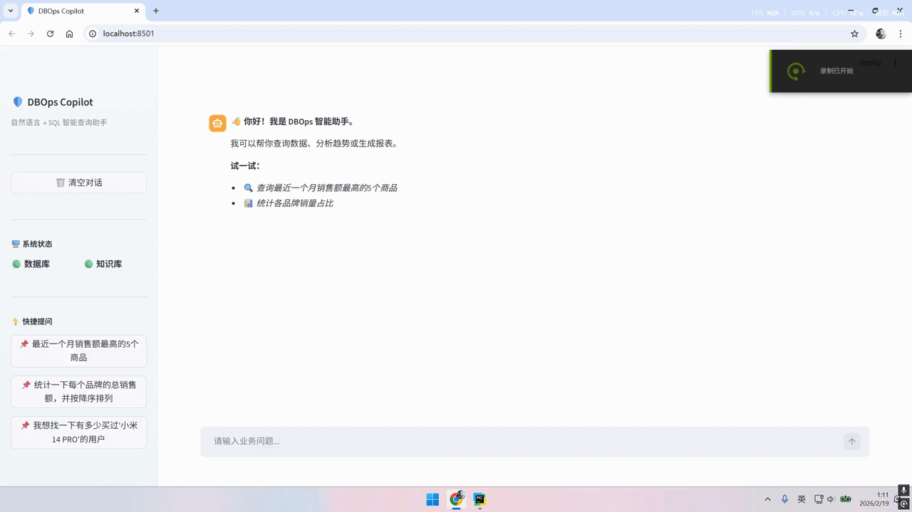
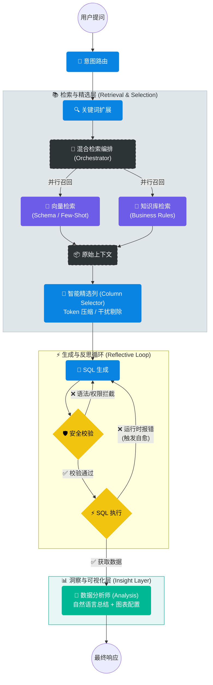

# DeepOps Enterprise Copilot ⚡

> **Next-Gen Text-to-SQL Agent powered by LangGraph & Graph RAG**
> 
> *基于图谱增强与自我反思机制的企业级数据库运维智能助手*

[]()
[]()
[]()


*(演示：自然语言查询 -> 意图识别 -> 混合检索 -> 图谱推理 -> SQL 自愈生成 -> 智能可视化)*

## 📖 项目简介 (Introduction)

**DeepOps Enterprise Copilot** 是一个面向复杂企业数据库场景的智能运维 Agent。

针对传统 Text-to-SQL 在**多表关联 (JOIN)** 和 **业务术语理解** 上的痛点，本项目采用了 **LangGraph** 构建环形状态机，并创新性地引入了 **Schema Graph RAG** 技术。通过 NetworkX 构建的全库表关系图谱，系统能够自动计算最佳 JOIN 路径，结合语义检索（Milvus）和值扫描（Value Scanning），实现高准确率的 SQL 生成与自愈。

---

## 🚀 核心技术架构 (Architecture)

### 1. 🧠 Agentic Workflow (基于 LangGraph 的状态机)
系统摒弃了线性的 Chain 结构，采用 **LangGraph** 定义了一个具备“反思”能力的循环工作流：



2. 🌟 核心特性 (Features)

🛡️ 企业级 RAG 检索：融合向量检索 (Milvus) 与 关键词匹配，精准定位 Schema 和业务规则。

🎯 智能精选列 (Smart Selection)：在生成 SQL 前，先通过 LLM 剔除无关列，大幅减少上下文 Token 消耗，提升准确率。

⚡ SQL 自愈机制：生成 -> 校验 -> 执行 -> 报错重试 (Reflective Loop)，像人类工程师一样自动修复 SQL 错误。

📊 智能可视化 (Auto Viz)：Agent 自动判断数据特征，生成 ECharts/Streamlit 图表配置（柱状图、折线图、饼图等）。

🖥️ 全栈交互：提供 FastAPI 流式接口 (NDJSON) 与 Streamlit 交互式前端。

## 2. 项目结构（阶段性演进）
```text
dbops-enterprise-copilot/
├── 📜 main.py                    # [Entry] FastAPI 后端启动入口 (Lifespan 预热)
├── 📜 app_ui.py                  # [Entry] Streamlit 前端启动入口
├── 📂 app/
│   ├── 📂 api/
│   │   └── v1/
│   │       └── agent.py          # [API] 核心 Agent 对话接口路由
│   │
│   ├── 📂 core/                  # [Infra] 基础设施与单例配置
│   │   ├── config.py             # 全局环境变量配置
│   │   ├── embedding.py          # Embedding 模型单例
│   │   ├── llm.py                # LLM 模型工厂
│   │   ├── logger.py             # 日志配置系统
│   │   ├── mysql_saver.py        # LangGraph 状态持久化 (Checkpoint)
│   │   ├── prompts.py            # Prompt 模板库 (管理所有提示词)
│   │   ├── rag_store.py          # Milvus DAO (向量库管理)
│   │   ├── reranker.py           # Rerank 重排序模型单例
│   │   └── state.py              # AgentState 全局状态定义
│   │
│   ├── 📂 graph/                 # [Brain] LangGraph 智能体状态机
│   │   ├── graph.py              # 工作流编排 (Workflow & Edges)
│   │   └── 📂 nodes/             # 独立原子功能节点
│   │       ├── router_node.py          # 🚦 意图识别与路由
│   │       ├── expand_node.py          # 🔍 关键词扩展与联想
│   │       ├── retrieval_node.py       # 📚 混合检索调度 (Orchestrator调用)
│   │       ├── column_selector_node.py # 🎯 智能精选列 (Schema Pruning)
│   │       ├── generate_node.py        # 📝 SQL 生成与修正
│   │       ├── verification_node.py    # 🛡️ 语法检查与权限审计
│   │       ├── execution_node.py       # ⚡ SQL 执行与反馈
│   │       └── analysis_node.py        # 📊 结果分析与可视化配置
│   │
│   └── 📂 modules/               # [Components] 核心业务组件
│       ├── 📂 retrieval/         # 🔍 检索增强引擎 (RAG Engine)
│       │   ├── orchestrator.py       # 🧠 总检索编排器
│       │   ├── 📂 graph/             # 🕸️ Graph RAG (图谱增强)
│       │   │   ├── builder.py            # 图构建器 (NetworkX)
│       │   │   ├── searcher.py           # 路径搜索 (Steiner Tree)
│       │   │   └── service.py            # 图服务单例
│       │   ├── 📂 knowledge/         # 🧠 业务知识库
│       │   │   └── retriever.py          # 规则检索器
│       │   └── 📂 schema/            # 🗃️ Schema 向量库
│       │       ├── retriever.py          # 表/列向量检索
│       │       └── value_linker.py       # 值-列 语义映射 (Value Linking)
│       │
│       └── 📂 sql/               # ⚡ 执行层
│           ├── executor.py           # SQL 执行器 (连接池管理)
│           └── guardrail.py          # 安全护栏 (Read-Only 拦截)
│
└── 📂 assets/                    # 静态资源
    └── demo.gif
```
